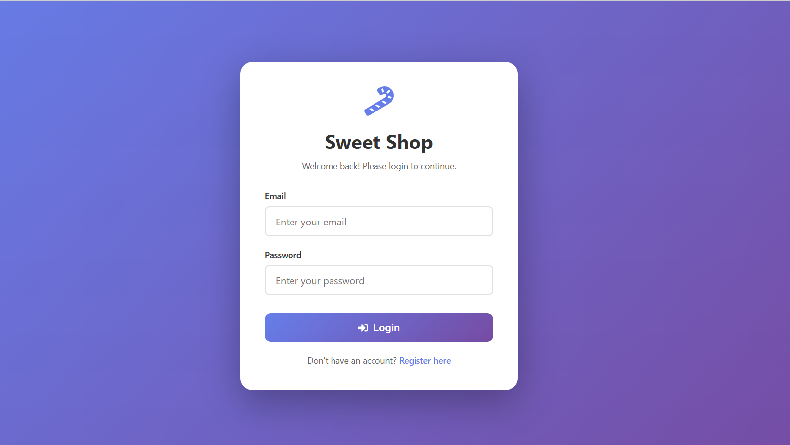
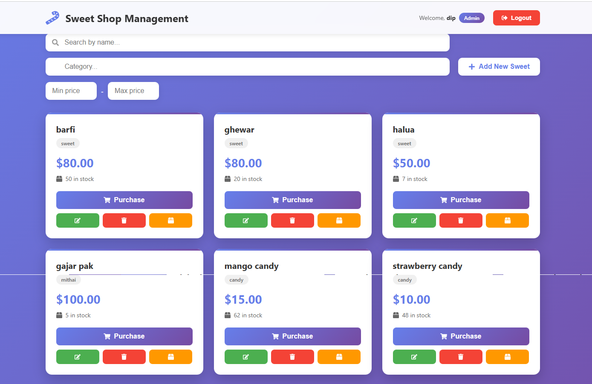
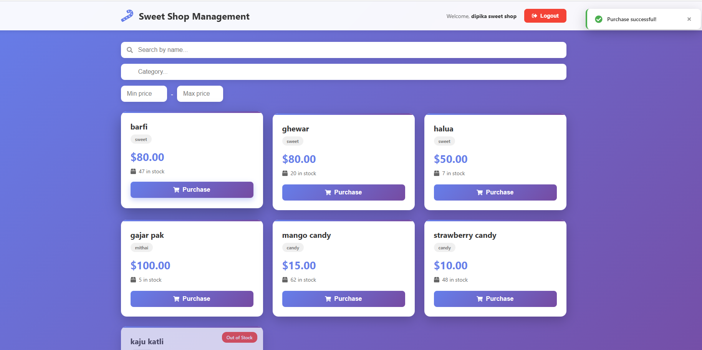

# Sweet Shop Management System

The Sweet Shop Management System is a full-stack web application for managing inventory, sales, and operations of a sweet shop. Built with Node.js, Express.js, MongoDB, and React, it digitizes inventory management and automates core business processes. The system provides two interfaces: a customer-facing interface for browsing, searching, and purchasing sweets, and an administrative interface for managing products, inventory, and operations. It features JWT-based authentication with role-based access control, allowing regular users to browse and purchase products while administrators have full CRUD capabilities to add, edit, delete, and restock products. The application includes advanced search and filtering by name, category, and price range, real-time inventory updates when purchases are made, and automatic stock level management. The backend is a RESTful API built with Express.js that handles business logic, authentication, and data processing, while the frontend is a React single-page application with a responsive design. The system uses MongoDB for flexible data storage, implements secure password hashing with bcryptjs, and includes input validation and error handling. The project demonstrates full-stack development skills, modern web architecture, and software engineering practices, with a test suite achieving 100% pass rate and 81.64% code coverage. It is production-ready, well-documented, and deployable, suitable for small to medium-sized sweet shop businesses looking to modernize their operations and improve efficiency.

## Live Demo

- **Frontend (User Interface):** https://vercel-frontend-sweetshop-managemen.vercel.app/

## Features

### Backend (Node.js/Express)
- ✅ RESTful API with Express.js
- ✅ MongoDB Atlas database integration
- ✅ JWT-based authentication
- ✅ User roles (User/Admin)
- ✅ CRUD operations for sweets
- ✅ Search and filter functionality
- ✅ Inventory management (purchase/restock)
- ✅ Comprehensive test coverage

### Frontend (React)
- ✅ Modern, responsive UI design
- ✅ User authentication (Login/Register)
- ✅ Dashboard with sweet listings
- ✅ Real-time search and filtering
- ✅ Purchase functionality
- ✅ Admin panel for managing sweets
- ✅ Smooth animations and transitions

## Project Structure

```
sweet-shop-management-system/
├── backend/
│   ├── src/
│   │   ├── __tests__/          # Test files
│   │   ├── controllers/        # Route controllers
│   │   ├── middleware/         # Auth middleware
│   │   ├── models/             # MongoDB models
│   │   ├── routes/             # API routes
│   │   └── server.js           # Entry point
│   ├── package.json
│   └── .env.example
├── frontend/
│   ├── src/
│   │   ├── components/         # React components
│   │   ├── context/            # React context
│   │   ├── pages/              # Page components
│   │   └── main.jsx            # Entry point
│   ├── package.json
│   └── vite.config.js
└── README.md
```

## Prerequisites

- Node.js (v18 or higher)
- npm or yarn
- MongoDB Atlas account (or local MongoDB instance)

## Setup Instructions

### 1. Clone the Repository

```bash
git clone <repository-url>
cd sweet-shop-management-system
```

### 2. Backend Setup

```bash
cd backend
npm install
```

Create a `.env` file in the `backend` directory:

```env
PORT=5000
MONGODB_URI=your_mongodb_atlas_connection_string
JWT_SECRET=your_super_secret_jwt_key
NODE_ENV=development
```

**Getting MongoDB Atlas Connection String:**
1. Go to [MongoDB Atlas](https://www.mongodb.com/cloud/atlas)
2. Create a free cluster
3. Click "Connect" → "Connect your application"
4. Copy the connection string
5. Replace `<password>` with your database password
6. Replace `<dbname>` with `sweet-shop` (or your preferred database name)

### 3. Frontend Setup

```bash
cd frontend
npm install
```

### 4. Running the Application

**Start Backend Server:**
```bash
cd backend
npm run dev
```
The backend will run on `http://localhost:5000`

**Start Frontend Development Server:**
```bash
cd frontend
npm run dev
```
The frontend will run on `http://localhost:3000`

### 5. Running Tests

```bash
cd backend
npm test
```

## API Endpoints

### Authentication
- `POST /api/auth/register` - Register a new user
- `POST /api/auth/login` - Login user

### Sweets (Protected - Requires JWT Token)
- `GET /api/sweets` - Get all sweets
- `GET /api/sweets/search` - Search sweets (query params: name, category, minPrice, maxPrice)
- `POST /api/sweets` - Create a new sweet (Admin only)
- `PUT /api/sweets/:id` - Update a sweet (Admin only)
- `DELETE /api/sweets/:id` - Delete a sweet (Admin only)
- `POST /api/sweets/:id/purchase` - Purchase a sweet
- `POST /api/sweets/:id/restock` - Restock a sweet (Admin only)

### Example API Request

```bash
# Login
curl -X POST http://localhost:5000/api/auth/login \
  -H "Content-Type: application/json" \
  -d '{"email":"user@example.com","password":"password123"}'

# Get all sweets (with token)
curl -X GET http://localhost:5000/api/sweets \
  -H "Authorization: Bearer YOUR_JWT_TOKEN"
```

## Usage Guide

### For Regular Users
1. Register/Login to your account
2. Browse available sweets on the dashboard
3. Use the search bar to find specific sweets
4. Click "Purchase" to buy a sweet (quantity decreases automatically)
5. Purchase button is disabled when a sweet is out of stock

### For Admin Users
1. Register/Login with admin role
2. All regular user features are available
3. Click "Add New Sweet" to create a new sweet item
4. Click the edit icon (✏️) to update sweet details
5. Click the delete icon (🗑️) to remove a sweet
6. Click the restock icon (📦) to add more quantity to a sweet

## Screenshots
### Registration Page


### Login Page


### Admin Dashboard


### User Dashboard


## Test Coverage

The backend includes comprehensive test coverage for:
- User authentication (register/login)
- Sweet CRUD operations
- Search functionality
- Purchase and restock operations
- Admin authorization

Run tests with:
```bash
cd backend
npm test
```

## Technologies Used

### Backend
- **Node.js** - Runtime environment
- **Express.js** - Web framework
- **MongoDB** - Database (via Mongoose)
- **JWT** - Authentication
- **bcryptjs** - Password hashing
- **Jest** - Testing framework

### Frontend
- **React** - UI library
- **React Router** - Routing
- **Axios** - HTTP client
- **Vite** - Build tool
- **React Icons** - Icon library

## Development Workflow

This project follows Test-Driven Development (TDD) principles:
1. **Red**: Write failing tests first
2. **Green**: Implement functionality to pass tests
3. **Refactor**: Improve code while keeping tests green

## Deployment

### Frontend (Vercel)

The frontend is deployed on **Vercel**:

- **Live URL:** https://vercel-frontend-sweetshop-managemen.vercel.app/

### Backend Deployment (Heroku/Railway/Render)
1. Set environment variables in your hosting platform
2. Ensure MongoDB Atlas allows connections from your server IP
3. Deploy the backend code

### Frontend Deployment (Vercel/Netlify)
1. Build the frontend: `npm run build`
2. Deploy the `dist` folder
3. Update API URLs if needed

## Contributing

1. Fork the repository
2. Create a feature branch
3. Make your changes
4. Write/update tests
5. Submit a pull request

## License

This project is open source and available under the MIT License.

---

## My AI Usage 

This project was developed primarily through hands-on implementation and manual design decisions.  
AI-assisted tools (such as Cursor AI) were used **sparingly** as a productivity aid during development.

### How AI Was Used
- Occasional assistance for initial project setup and configuration references
- Guidance on best practices for code organization and structure
- Support in resolving syntax errors and minor debugging issues
- Help with formatting and organizing documentation

### Development Ownership
- All core features, business logic, and application architecture were implemented manually
- Authentication, authorization, database models, and API behavior were designed and coded by me
- AI suggestions were reviewed, adapted, or rejected based on project requirements
- All test cases were written and verified manually

AI tools were used in a limited, responsible manner—similar to documentation or reference material—to improve efficiency without compromising understanding or ownership of the code.


**Conclusion:**
AI tools like Cursor AI proved to be valuable assistants in this project, helping with repetitive tasks and providing learning opportunities. However, the core logic, architecture decisions, and understanding of the codebase remain my own. The AI served as a powerful pair-programming partner, but I maintained full control and understanding of the code throughout the development process.

---

## Contact

For questions or support, please open an issue in the repository.


